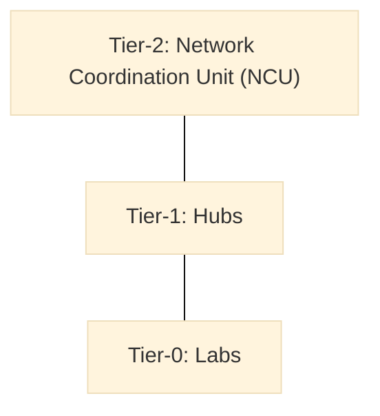

> **Editorial note (non-normative):**  
> This chapter has been editorially refined to improve clarity, narrative flow,
> and reader orientation for first-time readers. No definitions, governance rules,
> structural elements, or normative content of the Vigía Innovation Lab Framework
> (VILF) have been modified.

# Vigía Innovation Lab Framework (VILF) 1.0

This executive summary provides a high-level orientation to what VILF is, why it
exists, and how the document is structured before the detailed chapters begin.

## 00 – Executive Summary

### 0.1 Purpose of VILF
The Vig｛ Innovation Lab Framework (VILF) treats innovation labs as systemic capabilities within national or multi-institutional ecosystems and provides a structured orientation for their design and long-term sustainability. Detailed governance, funding, MEL, and operating mechanics are handled in later chapters.

VILF is part of the Vig｛ Framework Family (VXF) and aligns with MCF 2.1, IMM, IMM-Pr, IGF, and MEL; these are explained in subsequent chapters.

With the purpose set, the next section lists the capabilities VILF is designed to enable without detailing their implementation.

### 0.2 What VILF Enables
VILF allows countries or institutions to:
- provide a predictable operating context for innovation labs,
- define the scope for scaling from isolated pilots to robust networks,
- establish a shared frame for evidence and learning across institutions,
- set a common basis for governance and performance expectations,
- align innovation with public value, strategic outcomes, and policy impact,
- professionalize the innovation function.

These are stated as orientation-level outcomes; diagnostic analysis and implementation detail are addressed in later chapters.

Having outlined the capabilities VILF enables, the next section identifies the intended users and decision makers it is designed to serve.

### 0.3 Who Should Use This Framework
VILF is designed for:
- governments establishing national innovation lab networks,
- universities and multi-institutional coalitions launching shared labs,
- private-sector groups building distributed innovation units,
- international organizations supporting national innovation ecosystems.

To orient those audiences in practice, the following section provides a concise structural map of the framework's components.

### 0.4 Structure of VILF
VILF is composed of 16 components across Chapters 00–15:
- Executive Summary  
- Introduction  
- Ecosystem Diagnostic  
- System Architecture  
- Operating Model  
- Funding Model  
- Benchmarking  
- KPIs & Scorecard  
- Roadmap & Phasing  
- Governance & Legal Toolkit  
- Templates & Tools  
- References  
- License  
- Release Notes  
- Roadmap (Future Versions)  
- Annexes  

With the structure established, the next section explains how to navigate the document based on different reading needs.

### 0.5 How to Read This Document
This document may be read:
- linearly (Chapters 00–15),
- by functional domain (architecture, governance, funding, MEL),
- or by role (lab manager, hub coordinator, NCU director).

Each chapter ends with a connection block linking to the next chapter.

---

The following usability overview provides a compact map of the system structure before the detailed chapters begin.

## 00a – How the Framework Works (Usability Overview)
:::info Diagram: Tier Architecture Map

This diagram shows the three VILF tiers and their structural relationships, without implying sequence or authority beyond the chapter text.
:::

### 00a.1 Conceptual Model
VILF is built using a three-tier architecture:
- **Tier-0: Labs** → execute innovation cycles and generate evidence.
- **Tier-1: Hubs** → coordinate multiple labs, build capability, manage portfolios.
- **Tier-2: Network Coordination Unit (NCU)** → governs standards, MEL, accreditation.

These tiers operate as a single interoperable system.

### 00a.3 Core Spine Definitions
- **Execution Spine:** IMM-P®  
- **Governance Spine:** IGF  
- **Capability Spine:** IMM  
- **Performance Spine:** MEL  
- **Infrastructure Spine:** evidence repository + documentation system  

### 00a.4 Connection to Introduction
The next chapter introduces the rationale, principles, and positioning of VILF within global innovation practice.
