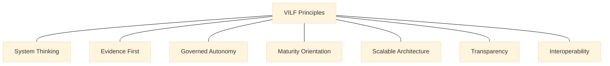

> **Editorial note (non-normative):**  
> This chapter has been editorially refined to strengthen explanatory flow and
> conceptual clarity, in alignment with the VILF canonical manuscript. No
> definitions, governance rules, or normative content have been modified.

# Chapter 01 - Introduction

## 01.1 Why Innovation Lab Networks?

Innovation labs emerged globally as mechanisms for solving complex public and institutional challenges. However, single labs operating in isolation often struggle with:

- limited scale,  
- lack of capacity,  
- fragmented governance,  
- inconsistent evidence practices,  
- unsustainable funding,  
- uneven capability across teams.

A **network model** solves these limitations by providing:

- shared capability,  
- shared infrastructure,  
- normalized governance,  
- collective learning,  
- cross-institutional collaboration,  
- consistency across experiments,  
- and scalable national impact.

With the context established for why networks are needed, the next section explains what positions VILF as a distinct framework within that landscape.

## 01.2 What Makes VILF Different

VILF is:

- **agnostic** (works for any country or institution),  
- **architectural** (not a methodology, but a system design),  
- **governance-centric** (integrates IGF directly),  
- **evidence-driven** (mandatory repositories),  
- **maturity-aware** (IMM-aligned),  
- **execution-standardized** (IMM-P®),  
- **scalable** (Wave-based expansion model).

The combination of MCF + IMM + IMM-P® + IGF + MEL produces a holistic, interoperable system.

With the framework positioned, the following section summarizes the systemic problems this architecture is designed to address.
With the framework positioned, the next section summarizes the core principles that anchor the VILF approach.

## 01.3 Principles of VILF
:::info Diagram: VILF Principles Map

This diagram shows the stated VILF principles as a non-sequential set anchored to a single conceptual core.
:::

The framework is defined by a set of principles that orient how the system is designed and governed:

- **System Thinking**
- **Evidence First**
- **Governed Autonomy**
- **Maturity Orientation**
- **Scalable Architecture**
- **Transparency**
- **Interoperability**

These principles are reflected across the chapters that follow; detailed application is addressed in later sections of the framework.

## 01.4 Problems VILF Addresses

VILF is designed to address systemic issues including:

- Structural fragmentation  
- No standard execution model  
- Unclear mandates  
- Talent and capability gaps  
- Lack of governance  
- Weak evidence integrity  
- Lack of scaling strategy  
- No performance measurement  
- Unsustainable funding models  

These problem statements set the rationale for the objectives that follow.

## 01.5 Objectives of VILF

The framework aims to:

1. Establish a coherent architecture for lab networks.  
2. Define a maturity-based capability progression pathway.  
3. Standardize execution using IMM-P®.  
4. Create governance stability using IGF.  
5. Build performance systems using MEL & benchmarking.  
6. Provide templates and tools for operational consistency.  
7. Enable sustainable funding models.  
8. Offer a scalable national deployment strategy.  

The objectives above translate into the chapter structure outlined next.

## 01.6 Structure of VILF

VILF is organized into the following chapters:

- **Chapter 02** - Ecosystem Diagnostic  
- **Chapter 03** - System Architecture  
- **Chapter 04** - Operating Model  
- **Chapter 05** - Funding Model  
- **Chapter 06** - Benchmarking  
- **Chapter 07** - KPIs & Scorecard  
- **Chapter 08** - Roadmap & Phasing  
- **Chapter 09** - Governance & Legal Toolkit  
- **Chapter 10** - Templates & Tools  
- **Chapter 11** - References  
- **Chapter 12** - License  
- **Chapter 13** - Release Notes  
- **Chapter 14** - Roadmap  
- **Annexes** - Full implementation instruments  

## 01.7 Connection to Next Chapter

The next chapter (Chapter 02) provides a diagnostic model for assessing readiness across institutions, which is essential before deploying labs or hubs.
