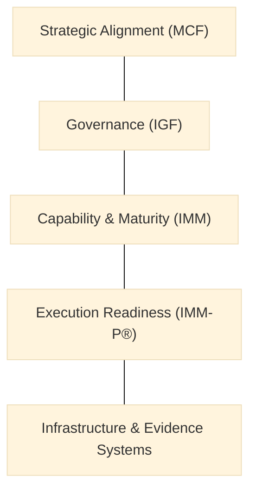

> **Editorial note (non-normative):**  
> This chapter has been editorially refined to improve clarity and diagnostic
> framing, while remaining aligned with the VILF canonical manuscript. No
> definitions, governance rules, or normative content have been modified.

## 02 – Ecosystem Diagnostic

### 2.1 Purpose of the Diagnostic
The diagnostic evaluates whether an institution, sector, or country is ready to deploy innovation labs, hubs, and networks using VILF (World Bank, 2022; ISO, 2019). It establishes go/no-go readiness by identifying maturity levels, capability gaps, governance barriers, and funding conditions. Diagnostic results directly condition the architecture and governance choices in subsequent chapters (OECD, 2015).

### 2.2 Diagnostic Pillars
:::info Diagram: Diagnostic Pillars Stack

This diagram is descriptive and non-normative; it lists the five diagnostic pillars as a conceptual stack, without implying scoring or thresholds.
:::
The diagnostic evaluates five pillars:
- **Strategic Alignment (MCF)**  
- **Governance (IGF)**  
- **Capability & Maturity (IMM)**  
- **Execution Readiness (IMM-P)**  
- **Infrastructure & Evidence Systems**  

Each pillar has a structured set of indicators. Each pillar assesses readiness rather than performance.

### 2.3 Readiness Levels
Readiness is classified as:
- Initial  
- Emerging  
- Developing  
- Established  
- Strategic  

These align with IMM maturity levels and are used as diagnostic classifications, not maturity targets.

### 2.4 Diagnostic Methods
Includes:
- document review,
- interviews,
- capability mapping,
- systems analysis,
- evidence review,
- funding landscape analysis.

These methods describe evidence categories, not execution steps (OECD, 2020). Execution details are defined in annexes or later phases.

### 2.5 Diagnostic Outputs
- readiness scorecard,
- capability map,
- funding readiness profile,
- governance readiness profile,
- implementation recommendations,
- risks and mitigation pathways.

These outputs are decision artifacts that inform the system architecture in Chapter 03.

### 2.6 Minimum Conditions for Launch
A system may only proceed when:
- mandates are clear,
- funding streams identified,
- governance structures defined,
- hub architecture validated,
- documentation infrastructure prepared.

These are gating thresholds, not recommendations.

### 2.7 Connection to System Architecture
Chapter 03 uses diagnostic outputs to define the architecture of the lab ecosystem, making the diagnostic a direct constraint on design choices.

## References
ISO (2019) *ISO/TR 56004:2019 Innovation Management Assessment — Guidance*. Geneva: International Organization for Standardization.

OECD (2015) *The Innovation Imperative in the Public Sector: Setting an Agenda for Action*. Paris: OECD Publishing.

OECD (2020) *The Public Sector Innovation Lifecycle: A device to assist public sector organisations in developing an innovation process*. OECD Working Papers on Public Governance. Paris: OECD Publishing.

World Bank (2022) *Digital Government Readiness Assessment (DGRA) Toolkit* (online). Washington, DC: World Bank.
