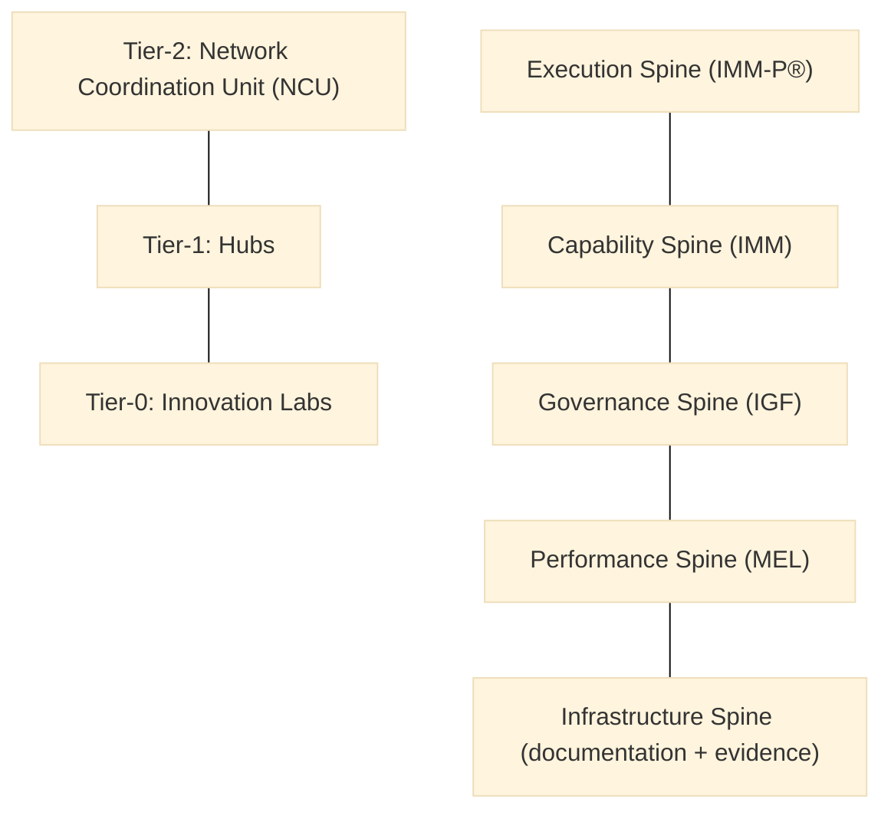

> **Editorial note (non-normative):**  
> This chapter has been editorially refined to improve system-architecture clarity
> and structural coherence, in alignment with the VILF canonical manuscript. No
> definitions, governance rules, or normative content have been modified.

## 03 – System Architecture

### 3.1 Purpose of the System Architecture
This chapter defines the structural architecture of a VILF ecosystem, including labs, hubs, the NCU, evidence flows, documentation systems, and capability spines. It translates diagnostic outputs from Chapter 02 into system constraints that shape how components relate. Execution and governance mechanics are defined in later chapters.

### 3.2 Architectural Layers
:::info Diagram: VILF Architecture Tiers and Spines

This diagram is descriptive and non-normative; it summarizes the tiered architecture and cross-cutting spines described in this chapter without implying sequence or authority beyond the text.
:::
VILF architecture includes:
- **Tier-0:** Innovation Labs  
- **Tier-1:** Hubs  
- **Tier-2:** Network Coordination Unit (NCU)  
- **Cross-cutting systems:** evidence, documentation, governance, capability, MEL.

These layers establish the structural boundary conditions that the component tiers must interface with.

### 3.3 Tier-0: Lab Architecture
Labs are the Tier-0 structural units where innovation activity is housed and evidenced, defining the base interface for the network.

Minimum components:
- lab manager,  
- service/design capability,  
- experimentation capability,  
- evidence officer,  
- subject matter experts (as needed).

The hub layer exists to coordinate and normalize multiple labs without replacing their local autonomy.

### 3.4 Tier-1: Hub Architecture
Hubs provide the Tier-1 structural layer that connects labs to network-level coordination and shared capabilities.

Hubs are intermediaries between labs and the NCU.

The NCU provides the top-level structural anchor that standardizes the system across all hubs and labs.

### 3.5 Tier-2: Network Coordination Unit Architecture
The NCU is the Tier-2 structural anchor that standardizes the system and maintains interoperability across tiers.

The NCU is the backbone for interoperability and long-term sustainability.

The cross-cutting spines describe how shared system functions persist across all tiers.

### 3.6 Cross-Cutting Systems
Five key spines operate across all tiers:
- **Execution Spine (IMM-P)**  
- **Capability Spine (IMM)**  
- **Governance Spine (IGF)**  
- **Performance Spine (MEL)**  
- **Infrastructure Spine (documentation + evidence)**  

These spines define structural constraints that preserve coherence across the network.

Evidence and documentation are treated as architectural components because they determine system traceability.

### 3.7 Evidence Flow & Repository Structure (Reconstructed)
Evidence is a core structural dependency of VILF.
The repository structure includes:
- research logs,  
- interview notes,  
- experimentation results,  
- prototyping documentation,  
- decision records,  
- governance escalations,  
- MEL outputs.

Evidence must:
- be standardized,  
- be tagged with metadata,  
- follow versioning rules,  
- remain auditable by hubs and NCU.

The infrastructure spine formalizes how documentation and evidence are stored and accessed across the system.

### 3.8 Infrastructure Spine (Reconstructed)
The infrastructure spine consists of:
- documentation repository,  
- knowledge base,  
- metadata standards,  
- access and permission rules,  
- platform-agnostic storage architecture.

It defines the structural conditions for traceability, interoperability, and transparency.

The governance spine formalizes decision boundaries without prescribing operational steps.

### 3.9 Governance Spine (Reconstructed)
The governance spine (IGF) defines the decision-boundary structure across tiers and the constraints that keep the system interoperable.

The capability spine defines the structural expectations for maturity progression without specifying how training is delivered.

### 3.10 Capability Spine (Reconstructed)
The capability spine uses IMM to define the structural expectations for maturity progression and role-based competency growth.

Interoperability rules summarize the system-level dependencies that prevent fragmentation.

### 3.11 Interoperability Rules Across Labs, Hubs, NCU (Reconstructed)
Interoperability requires shared templates, unified evidence tags, common governance patterns, and shared maturity and performance definitions. This prevents fragmentation and ensures learnings circulate.

### 3.12 Connection to Operating Model
Chapter 04 translates the architecture into an operating model while preserving the structural constraints defined here.
