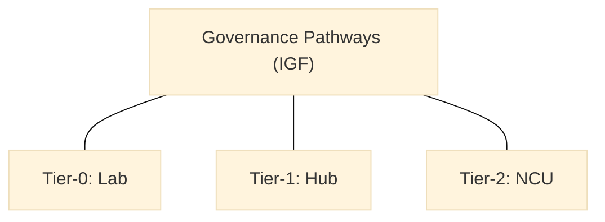

> **Editorial note (non-normative):**  
> This chapter has been editorially refined to improve governance clarity and
> decision-structure legibility, in alignment with the VILF canonical manuscript.
> No governance rules, decision rights, escalation paths, or normative content
> have been modified.

## 04 – Operating Model

### How to Read This Chapter
The operating model translates architectural components into governance-aware operating logic. It defines roles, workflows, decision pathways, documentation standards, and collaboration patterns. It connects the system blueprint (Chapter 03) to the governance logic that shapes consistent operation across the ecosystem.

### 4.1 Purpose of the Operating Model
The operating model defines how labs, hubs, and the NCU align roles, decision boundaries, and operating responsibilities to ensure:
- predictable execution,
- capability building,
- evidence discipline,
- governance compliance,
- MEL integration,
- cross-lab collaboration,
- documentation flow.

Operational execution details are elaborated in later chapters and annexes.

### 4.2 Operating Model Principles
- Evidence First  
- Execution Discipline  
- Governed Autonomy  
- Transparency  
- Learning Integration  
- Scalable Processes  
- Maturity-Aligned Operations  

The following role groupings clarify accountability boundaries and decision ownership across tiers.

### 4.3 Roles and Responsibilities (Tier-0, Tier-1, Tier-2)

#### 4.3.1 Tier-0: Lab Roles
- Lab Manager  
- Service Designer  
- Experimentation Lead  
- Evidence Officer  
- Subject Matter Specialists  

#### 4.3.2 Tier-1: Hub Roles
- Hub Coordinator  
- Capability Coaches  
- Domain Specialists  
- MEL Officers  

#### 4.3.3 Tier-2: NCU Roles
- Network Director  
- Standards & Governance Unit  
- Learning & Performance Unit  
- Infrastructure Unit  

These role groupings establish governance-aligned accountability before execution spines are introduced.

### 4.4 IMM-P® as the Execution Spine
All lab projects must execute using:
1. Pre-Discovery  
2. Discovery  
3. Validation  
4. Solution Development  
5. Implementation Pathway  

Evidence artifacts are mandatory.

The workflow architecture below describes how decisions and handoffs align across tiers without prescribing local delivery steps.

### 4.5 Workflow Architecture

#### 4.5.1 Project Intake & Prioritization
Labs receive challenges from:
- sponsoring institutions,
- ecosystem actors,
- diagnostics,
- strategic priorities.

Hubs and NCU validate alignment.

#### 4.5.2 Portfolio Management
Hubs ensure:
- balanced portfolios,
- maturity consideration,
- MEL alignment,
- risk diversification.

#### 4.5.3 Collaboration Workflow
Labs collaborate through:
- shared research,
- cross-lab squads,
- domain clusters,
- hub-led capability sessions.

These workflow elements connect to formal decision pathways, which are clarified in the governance section.

### 4.6 Governance Pathways
:::info Diagram: Governance Pathways Map

This diagram is descriptive and does not define governance processes, decision flows, or execution authority.
It is non-normative.
:::
IGF decision tiers:
- Tier-0: Lab  
- Tier-1: Hub  
- Tier-2: NCU  

Escalations follow IGF rules.

This section defines decision boundaries and escalation logic rather than operational procedures.

### 4.7 Evidence & Documentation Standards
Labs must use:
- standardized templates,
- evidence logs,
- decision records,
- prototype logs,
- research repositories.

These standards support traceability and accountability; implementation details are handled in later chapters.

### 4.8 MEL Integration
MEL provides:
- quarterly review cycles,
- annual scorecards,
- performance-based funding inputs,
- learning synthesis.

MEL integration defines oversight cadence; detailed measurement logic is covered in Chapter 07.

### 4.9 Capability Development
The capability spine ensures:
- IMM progression,
- coaching,
- training,
- competency building.

Capability development defines expectations and progression; delivery mechanisms are addressed later.

### 4.10 Connection to Funding Model
Chapter 05 explains how operations are financed sustainably.
