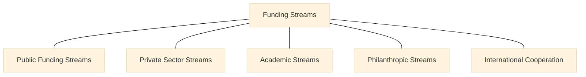

> **Editorial note (non-normative):**  
> This chapter has been editorially refined to improve clarity and internal
> coherence of the VILF funding and sustainability logic, in alignment with the
> canonical manuscript. No financial rules, funding mechanisms, or normative
> constraints have been modified.

## 05 – Funding Model

### How to Read This Chapter
This chapter defines the funding logic and sustainability principles that enable the VILF architecture and governance to function over time. Funding supports the system; it does not define its structure. Operational budgeting and execution details are addressed elsewhere.

### 5.1 Purpose of the Funding Model
Funding must:
- support stability,
- ensure predictability,
- enable growth,
- align with performance,
- provide diversification,
- sustain governance and evidence systems.

These principles describe system viability rather than short-term financial optimization.
These principles align with public-sector innovation enabling conditions and sustainability framing in the literature (OECD, 2015).

The sections below describe what must be funded across tiers to keep the system coherent (OECD, 2015).

### 5.2 What Must Be Funded

#### 5.2.1 Tier-0: Lab Funding
Covers:
- staffing,
- IMM-P cycles,
- research,
- prototyping,
- documentation systems.

#### 5.2.2 Tier-1: Hub Funding
Covers:
- capability building,
- portfolio management,
- shared infrastructure,
- MEL review,
- domain-specific support.

#### 5.2.3 Tier-2: Network Funding
Covers:
- governance,
- MEL synthesis,
- accreditation,
- platforms,
- transparency systems.

These categories define funding scope across tiers without prescribing allocation procedures.

### 5.3 Funding Principles

The principles below act as constraints that shape how funding sources are combined across the system.
- Diversification  
- Stability  
- Performance Alignment  
- Transparency  
- Reinvestment of Learning  
- Equity Across Labs  
- Outcome Orientation  

### 5.4 Multi-Stream Funding Architecture
:::info Diagram: Funding Streams Map

This diagram is descriptive and non-normative; it summarizes the funding stream categories named in the text, without implying prioritization or allocation.
:::

The funding streams below represent structural sources and constraints, not acquisition steps.

#### 5.4.1 Public Funding Streams
- national budgets,
- program budgets,
- innovation funds,
- development banks.

#### 5.4.2 Private Sector Streams
- partnerships,
- sponsorships,
- co-financed labs,
- in-kind contributions.

#### 5.4.3 Academic Streams
- research budgets,
- grants,
- student/faculty programs.

#### 5.4.4 Philanthropic Streams
- foundations,
- civil society,
- challenge grants.

#### 5.4.5 International Cooperation
- UN agencies,
- regional bodies,
- donor programs.

### 5.5 Challenge Funds
Provides a bounded funding mechanism for domain-specific experiments within the system.

### 5.6 Pooled Funds
Defines pooled contributions into shared system structures.

### 5.7 Performance-Based Funding
Allocation depends on:
- IMM-P execution,
- IGF compliance,
- scorecard results,
- collaboration.

This logic aligns funding oversight with system performance without prescribing operational metrics here.

### 5.8 Funding Governance
Funding flows follow IGF decision tiers and transparency rules to maintain governance alignment (IMF, 2018).

### 5.9 Long-Term Sustainability Models
Options:
- national budget integration,
- multi-year cycles,
- endowment funds,
- PPP co-financing,
- sectoral funding clusters.

Sustainability is treated as a system property over time rather than a single funding mechanism (IMF, 2018).

### 5.10 Connection to Benchmarking
Benchmarking informs fair and evidence-driven funding decisions in Chapter 06.

## References
OECD (2015) *The Innovation Imperative in the Public Sector: Setting an Agenda for Action*. Paris: OECD Publishing.

International Monetary Fund (IMF) (2018) *Public Investment Management Assessment (PIMA)*. Washington, DC: IMF.
