> **Editorial note (non-normative):**  
> This chapter has been editorially refined to improve clarity and comparative
> framing for benchmarking, in alignment with the VILF canonical manuscript. No
> governance rules, metric definitions, or normative content have been modified.

## 06 - Benchmarking

### How to Read This Chapter
Benchmarking enables fair comparison, capability mapping, and evidence-based resource allocation across labs, hubs, and networks (OECD, 2023; Nardo et al., 2008). It provides comparative context rather than prescribing operational steps.

### 6.1 Purpose of Benchmarking
Benchmarking identifies:
- performance differentials,
- capability gaps,
- high-performing and struggling units,
- system learning opportunities.

These comparisons are diagnostic and comparative, not evaluative targets.

With the purpose set, the next section lists the principles that constrain how benchmarking is interpreted.

### 6.2 Benchmarking Principles
- Normalization  
- Evidence-Based  
- Transparency  
- Comparability  
- Purpose-Driven  
- Continuous Learning  

These principles guide how benchmarking is framed before tier-specific assessments are described.

### 6.3 Benchmarking Architecture
:::info Diagram: Benchmarking Focus by Tier

```mermaid
%%{init: {'theme':'base','fontSize':16}}%%
flowchart LR
  B["Benchmarking Architecture"]
  T0["Tier-0: IMM-P® execution, evidence completeness, MEL results, IGF compliance"]
  T1["Tier-1: capability support, portfolio coordination, MEL review quality, documentation hygiene"]
  T2["Tier-2: interoperability, governance consistency, documentation flow, system learning"]
  B --- T0
  B --- T1
  B --- T2
```

This diagram is descriptive and non-normative; it summarizes the benchmarking focus areas by tier without implying sequence, scoring, or progression.
:::

#### 6.3.1 Tier-0
Evaluates:
- IMM-P execution,
- evidence completeness,
- rigor,
- MEL results,
- IGF compliance.

#### 6.3.2 Tier-1
Evaluates:
- capability support,
- portfolio coordination,
- MEL review quality,
- documentation hygiene.

#### 6.3.3 Tier-2
Evaluates:
- interoperability,
- governance consistency,
- documentation flow,
- system learning.

The tiered structure clarifies what each level can be compared on without prescribing how data is gathered.

### 6.4 Benchmarking Indicator Groups
- Execution (IMM-P)  
- Capability (IMM)  
- Governance (IGF)  
- MEL indicators  

These groups define consistent lenses for comparison rather than fixed scoring mechanisms.

### 6.5 Normalization Rules
Account for:
- mandates,
- maturity,
- team size,
- domain complexity.

Normalization establishes comparability constraints, not targets or thresholds (Nardo et al., 2008).

### 6.6 Benchmarking Methods
- comparative,
- longitudinal,
- cluster-based,
- network-level.

These methods describe analytic viewpoints, not procedural instructions.

### 6.7 Benchmarking Process Flow
This sequence describes the analytical order of benchmarking, not an execution workflow (Nardo et al., 2008):
1. Indicator verification  
2. Data submission  
3. Normalization  
4. Consolidation  
5. Analysis  
6. MEL integration  
7. Reporting  

### 6.8 Outputs
- benchmarking reports,
- capability plans,
- funding recommendations,
- cross-lab learning priorities.

These outputs feed decision-making in Chapter 07 without defining metrics here.

### 6.9 Connection to KPIs & Scorecard
Benchmarking provides comparative context for KPI interpretation in Chapter 07.

## References
Nardo, M., Saisana, M., Saltelli, A. and Tarantola, S. (2008) *Handbook on Constructing Composite Indicators: Methodology and User Guide*. Paris: OECD Publishing.

OECD (2023) *Government at a Glance 2023*. Paris: OECD Publishing.
