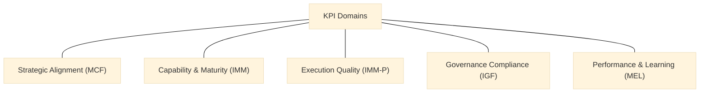

## 07 – KPIs & Scorecard (MEL Core System)

### How to Read This Chapter
This chapter operationalizes MEL through KPIs and scorecards for labs, hubs, and the NCU.

### 7.1 Purpose
KPIs:
- measure performance,
- track maturity,
- guide funding,
- enable governance,
- standardize quality.

### 7.2 KPI Architecture
:::info Diagram: KPI Domain Map

This diagram maps the five KPI domains as classification lenses only, without implying scoring or evaluation flow.
:::
5 domains:
1. Strategic Alignment (MCF)  
2. Capability & Maturity (IMM)  
3. Execution Quality (IMM-P)  
4. Governance Compliance (IGF)  
5. Performance & Learning (MEL)  

### 7.3 KPI Catalog

#### 7.3.1 Tier-0: Lab KPIs
- L1 IMM-P stage completion  
- L2 evidence quality  
- L3 experimentation diversity  
- L4 validation strength  
- L5 documentation completeness  
- L6 time-to-insight  
- L7 collaboration  
- L8 maturity progression  
- L9 governance compliance  

#### 7.3.2 Tier-1: Hub KPIs
- H1 capability delivery  
- H2 portfolio balance  
- H3 coordination effectiveness  
- H4 MEL review  
- H5 repository quality  
- H6 domain contribution  

#### 7.3.3 Tier-2: NCU KPIs
- N1 standard adoption  
- N2 interoperability  
- N3 benchmarking cycles  
- N4 MEL synthesis  
- N5 accreditation performance  
- N6 strategic alignment impact  

### 7.4 Scoring & Weighting
Weights:
- Strategic Alignment: 15%  
- Capability & Maturity: 20%  
- Execution Quality: 30%  
- Governance: 15%  
- MEL: 20%  

### 7.5 Evidence Requirements
Each KPI requires:
- logs,
- artifacts,
- decision records,
- maturity assessments,
- MEL outputs.

### 7.6 Performance Categories
- Strategic  
- Established  
- Developing  
- Emerging  
- Initial  

### 7.7 MEL Cycles
Quarterly: light reviews  
Annual: full audit + benchmarking + funding alignment  

### 7.8 Scorecard Templates
Includes:
- KPI list,
- evidence checklist,
- scoring sheet,
- classification rules.

### 7.9 Connection to Roadmap & Phasing
Scorecards shape expansion decisions in Chapter 08.
