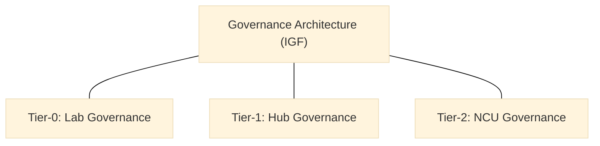

> **Editorial note (non-normative):**  
> This chapter has been editorially refined to improve governance clarity and
> decision-structure legibility, in alignment with the canonical manuscript. No
> governance rules, legal instruments, or normative content have been modified.

## 09 - Governance & Legal Toolkit

### How to Read This Chapter
This chapter defines the governance, legal, and accountability systems that ensure stable operation, integrity, and long-term sustainability of innovation lab networks. It clarifies decision authority and oversight boundaries across the ecosystem; operational execution details are addressed elsewhere.

### 9.1 Purpose
Governance ensures:
- system integrity,
- decision clarity,
- risk and ethics management,
- evidence discipline,
- transparency,
- sustainability across political cycles.

These purpose statements establish the governance intent; the next section defines the tiered architecture that carries that intent across the system.

### 9.2 Governance Architecture (IGF-Aligned)
:::info Diagram: Governance Tiers Map

This diagram is descriptive and non-normative; it summarizes the tiered governance architecture without implying decision sequences or enforcement steps.
:::
Three tiers:

#### Tier-0 — Lab Governance
Responsible for:
- project decisions,
- evidence compliance,
- experimentation authorization,
- early risk identification.

#### Tier-1 — Hub Governance
Responsible for:
- cross-lab coordination,
- capability support,
- portfolio governance,
- second-level escalation.

#### Tier-2 - NCU Governance
Responsible for:
- accreditation,
- standards,
- documentation,
- MEL synthesis,
- ethics and risk oversight,
- arbitration.

With the governance structure defined, the following section clarifies how decision rights and escalation pathways operate across tiers.

### 9.3 Decision Rights & Escalation
Labs escalate to hubs when:
- risks exceed thresholds,
- cross-lab coordination is needed.

Hubs escalate to NCU when:
- institutional risks appear,
- governance violations occur.

NCU is the final decision authority.

Decision rights set the authority boundaries; accreditation then defines how compliance and quality are validated across the same tiers.

### 9.4 Accreditation System

#### 9.4.1 Lab Accreditation
Must demonstrate:
- IMM-P compliance,
- documentation completeness,
- MEL participation,
- minimum maturity (emerging+),
- alignment with MCF.

#### 9.4.2 Hub Accreditation
Must demonstrate:
- capability-building delivery,
- portfolio governance,
- MEL competence,
- documentation hygiene.

#### 9.4.3 NCU Accreditation
Must demonstrate:
- governance maturity,
- documentation stewardship,
- MEL synthesis capability.

Accreditation sets the governance baseline; the legal instruments below operationalize these relationships across institutions.

### 9.5 Legal Instruments

#### 9.5.1 MoUs
Define collaboration across institutions.

#### 9.5.2 Terms of Reference
Define roles, mandates, obligations.

#### 9.5.3 Decrees (Optional)
Used for formalizing national networks.

#### 9.5.4 Data-Sharing Agreements
Ensure compliance with data protection and ethics.

#### 9.5.5 IP & Licensing Frameworks
Clarify:
- publication rights,
- prototype rights,
- open knowledge rules.

#### 9.5.6 PPP Agreements
Define co-financing, shared infrastructure, joint execution.

These instruments formalize governance commitments; the next section specifies the ethical and integrity constraints that apply within those commitments.

### 9.6 Risk, Ethics & Integrity Protocols
- risk management rules,
- ethics safeguards,
- integrity expectations,
- documentation discipline.

These protocols establish conduct boundaries; documentation and transparency then ensure traceability and accountability.

### 9.7 Documentation & Transparency
NCU maintains:
- repository standards,
- metadata rules,
- versioning,
- decision logs,
- reporting guidelines.

Governance documentation supports recurring oversight; the review cycles below define how that oversight is exercised over time.

### 9.8 Governance Review Cycles
Quarterly:
- governance health checks.

Annual:
- governance audits,
- accreditation cycles.

These cycles sustain governance integrity; the closing section links this toolkit to the supporting templates and tools.

### 9.9 Connection to Templates & Tools
Chapter 10 provides governance tools, checklists, matrices, and rubrics.
