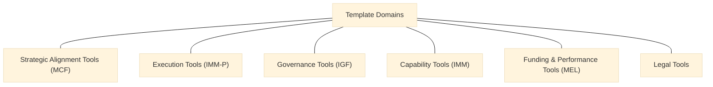

> **Editorial note (non-normative):**  
> This chapter has been editorially refined to improve clarity and internal
> coherence of the VILF templates and tools landscape, in alignment with the
> canonical manuscript. No tool categories, templates, or normative content have
> been modified.

## 10 - Templates & Tools

### How to Read This Chapter
This chapter provides the practical tools needed to implement VILF across roles and tiers. It clarifies how the tool categories support the framework without prescribing execution steps; detailed usage is defined in the relevant chapters and annexes.

### 10.1 Purpose
Tools ensure:
- standardization,
- documentation consistency,
- governance compliance,
- MEL integration,
- capability growth.

These purposes define why tooling exists; the next section groups the templates by domain to make the toolscape navigable.

### 10.2 Template Domains
:::info Diagram: Template Domains Map

This diagram summarizes the template domains as reference categories, without implying usage order or procedural guidance.
:::
1. Strategic Alignment Tools (MCF)  
2. Execution Tools (IMM-P)  
3. Governance Tools (IGF)  
4. Capability Tools (IMM)  
5. Funding & Performance Tools (MEL)  
6. Legal Tools  

The domain grouping provides orientation; the sections below list the canonical templates available in each domain.

### 10.3 Strategic Alignment Templates
- lab mandate charter  
- challenge intake form  
- stakeholder map  

### 10.4 Execution & Evidence Templates
- pre-discovery checklist  
- research pack  
- validation pack  
- solution development pack  
- implementation pathway template  

These execution templates support evidence discipline and stage clarity; they do not replace the operating logic defined in earlier chapters.

### 10.5 Governance Templates
- decision rights matrix  
- escalation blueprint  
- governance review checklist  
- accreditation rubric  

Governance templates operationalize accountability boundaries; the next section focuses on capability development tools.

### 10.6 Capability Templates
- IMM readiness assessment  
- capability plan  
- annual maturity reassessment  

Capability templates enable structured progression; the following section groups funding and performance tools.

### 10.7 Funding & Performance Templates
- KPI scorecard  
- MEL review pack  
- funding allocation template  
- challenge fund application  
- pooled fund contribution form  

These tools provide consistent performance and funding artifacts; legal instruments are listed next to formalize cross-institutional agreements.

### 10.8 Legal Templates
- MoU  
- ToR for labs, hubs, NCU  
- decree template  
- data-sharing agreement  
- IP template  
- PPP agreement  

Legal templates formalize collaboration; the deployment toolkits below provide structured launch references.

### 10.9 Deployment Toolkits
- lab launch toolkit  
- hub deployment toolkit  
- NCU establishment toolkit  
- network scaling toolkit  

These toolkits are reference anchors, not execution playbooks; the closing section links the toolset to the reference base.

### 10.10 Connection to References
Chapter 11 lists the global sources that inform these tools.
