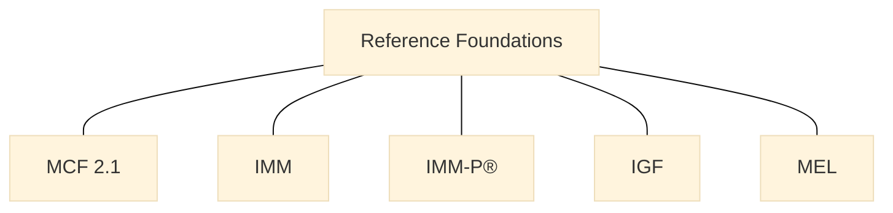

> **Editorial note (non-normative):**  
> This chapter has been editorially refined to improve clarity and positioning of
> references within VILF, in alignment with the canonical manuscript. No sources
> or normative content have been modified.

## 11 – References

### How to Read This Chapter
This chapter lists the foundational frameworks, global references, academic sources, and governance standards that inform VILF. These references provide context and lineage; they do not define execution requirements or prescribe workflows (OECD/Eurostat, 2018).

### 11.1 Foundational Frameworks
:::info Diagram: Reference Foundations Stack

This diagram is descriptive and non-normative; it summarizes the foundational references as contextual anchors without implying priority or compliance.
:::
- MCF 2.1  
- IMM  
- IMM-P®  
- IGF  
- MEL  
Innovation management system guidance and assessment references provide alignment context for these foundations (ISO, 2019; ISO, 2019).

### 11.2 Innovation Lab Literature
- Nesta  
- MindLab  
- Helsinki Design Lab  
- Policy Lab UK  
- UNDP Accelerator Labs  
- OECD OPSI  
- GovLab  
Public-sector innovation literature provides contextual grounding for lab-based capability development (OECD, 2015).

The governance sources that follow reflect public-sector accountability and institutional design.

### 11.3 Public-Sector Innovation & Governance
- OECD  
- European Commission  
- UNDP  
- World Bank  
- IDB  
These sources align with institutional governance framing and readiness diagnostics (OECD, 2020; World Bank, 2022).

Design and systems thinking references complement the governance lens with methods for framing complex problems.

### 11.4 Design & Systems Thinking
- IDEO  
- Stanford d.school  
- Donella Meadows  
- Eric Ries  
- Cynefin Framework  

Foresight references provide long-horizon planning and uncertainty navigation foundations.

### 11.5 Foresight & Futures
- UNESCO Futures Literacy  
- OECD Strategic Foresight  
- SOIF  
- Peter Schwartz  
- Herman Kahn  
- UN Global Pulse  
- Vigía Futura  

### 11.6 Data, Ethics & Innovation Governance
- OECD AI Principles  
- EU AI Act  
- IEEE  
- WEF  
- GovAI  
Risk and governance standards provide non-prescriptive context for integrity and oversight alignment (ISO, 2018; ISO, 2021).

Academic institutions listed below reflect research bases that inform many of these practices.

### 11.7 Academic Publications
- Harvard Kennedy School  
- MIT GOV/LAB  
- London School of Economics  
- ETH Zürich  
- University of Cambridge  

### 11.8 Supplementary Sources
- national innovation strategies  
- digital government strategies  
- governance frameworks  
Benchmarking and composite indicator methodology provide methodological context for comparative references (Nardo et al., 2008; OECD, 2023).

### 11.9 Connection to License
Chapter 12 describes how VILF may be shared under CC BY-NC-ND 4.0.

## References
OECD/Eurostat (2018) *Oslo Manual 2018: Guidelines for Collecting, Reporting and Using Data on Innovation*. 4th edn. Paris/Eurostat: OECD Publishing. doi:10.1787/9789264304604-en.

ISO (2019) *ISO 56002:2019 Innovation management — Innovation management system — Guidance*. Geneva: International Organization for Standardization.

ISO (2019) *ISO/TR 56004:2019 Innovation Management Assessment — Guidance*. Geneva: International Organization for Standardization.

OECD (2015) *The Innovation Imperative in the Public Sector: Setting an Agenda for Action*. Paris: OECD Publishing.

OECD (2020) *The Public Sector Innovation Lifecycle: A device to assist public sector organisations in developing an innovation process*. OECD Working Papers on Public Governance. Paris: OECD Publishing.

World Bank (2022) *Digital Government Readiness Assessment (DGRA) Toolkit* (online). Washington, DC: World Bank.

Nardo, M., Saisana, M., Saltelli, A. and Tarantola, S. (2008) *Handbook on Constructing Composite Indicators: Methodology and User Guide*. Paris: OECD Publishing.

ISO (2018) *ISO 31000:2018 Risk management — Guidelines*. Geneva: International Organization for Standardization.

ISO (2021) *ISO 37000:2021 Governance of organizations — Guidance*. Geneva: International Organization for Standardization.

OECD (2023) *Government at a Glance 2023*. Paris: OECD Publishing.
